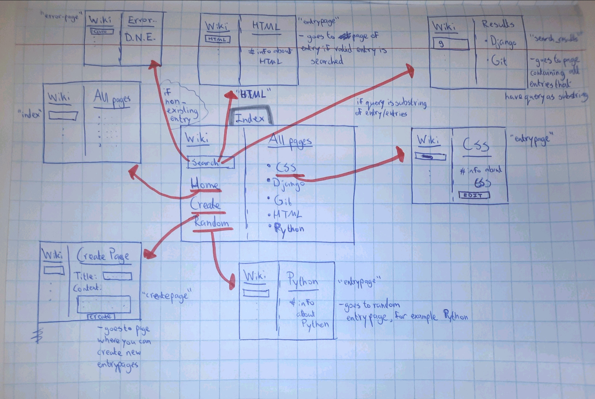
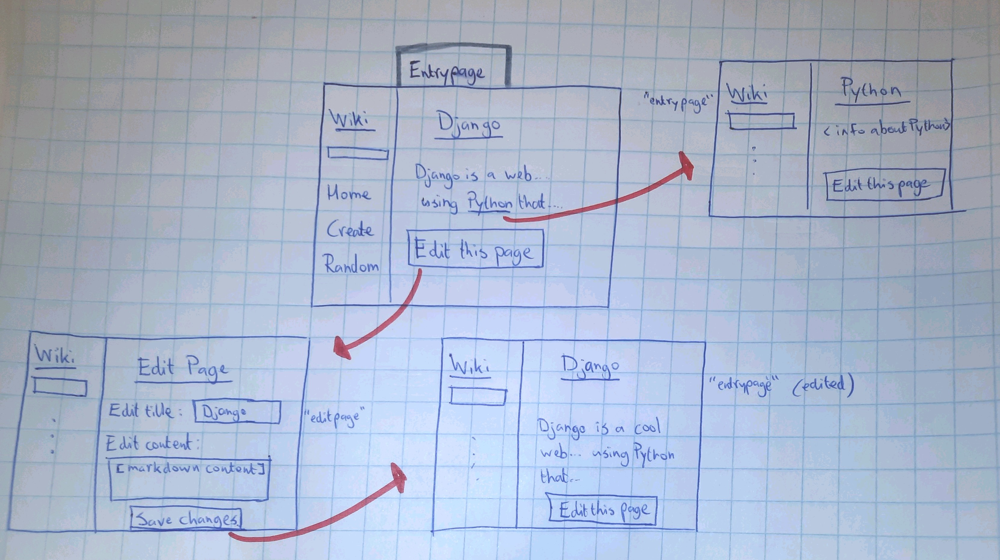
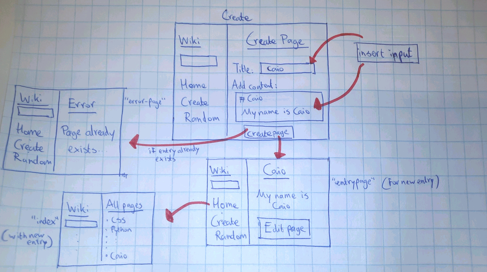

# Wiki

This is a encyclopedia-like web application in which the user is able to search
for entries, add entries to the encyclopedia, edit entrypages and more.

## Design Document

* In this Design Document I will start by explaining what should be done in order
to create a new page. In urls.py a new URL path should be created, that is associated
with a certain view function. This view function will be defined in views.py, and
will be the function that decides in which cases which pages get displayed to the
user. Then lastly, the actual HTML pages that the view function renders need to
be created. For each rendered page we will need a template.html file.

* Now I will provide a list of the HTML pages that I will probably need in order
to make this application complete:

The files that I will need are:
- index.html
- entrypage.html
- error.html
- layout.html
- createpage.html
- editpage.html
- searchresults.html

* Down below follow some sketches that describe the application workflow of my
website. One important note is that the functionality of the left side of the index
page (Searchbar, Home, Create, Random) should/work on all pages and is the basic
functionality of the website, although it is not demonstrated in every single sketch.

First the sketch of the index page. As mentioned, the most important features
are the search bar, which lets you search for a specific entry.
- If your search query matches an exact entry name, you get redirected to that page.
- If your search query is part of substring of one or more entries, you are redirected
to a page that displays all such search results.
- If your seach query matches none of the existing entries, you get redirected to
an error page.

The Create button takes you to a page where you can create new entries, more about
this page follows later.

The Random button takes you to a random existing entry page of the encyclopedia.

Furthermore the page displays a list of all existing entries in the encyclopedia.
Each entry name is also a link, which will take you the corresponding entry page.

Lastly, the Home button always takes you back to the index page.

On each entry page there is information displayed about the particular entry.
If one of the entries is also part of this information, hyperlinks are created,
so that it is possible to go to that entry page directly.

At the bottom you can find the "Edit Page" button. Clicking on this takes you to
a new page where you can edit the markdown content of the entrypage.
Once you click on "Save Changes" your edit will be saved to the page and you will
be redirected to the newly edited page.

Lastly I have made a sketch of the "Create" page. Here you can create and add
new entries to the encyclopedia. It is possible to add a title and markdown code which will be displayed as the content of the page.
After clicking on "Create Page" you will be redirected if the entry does not exist
yet. If it already existed, you will be redirected to an error-page.

This new entry now also appears on the "Home" page where all entries are listed.

